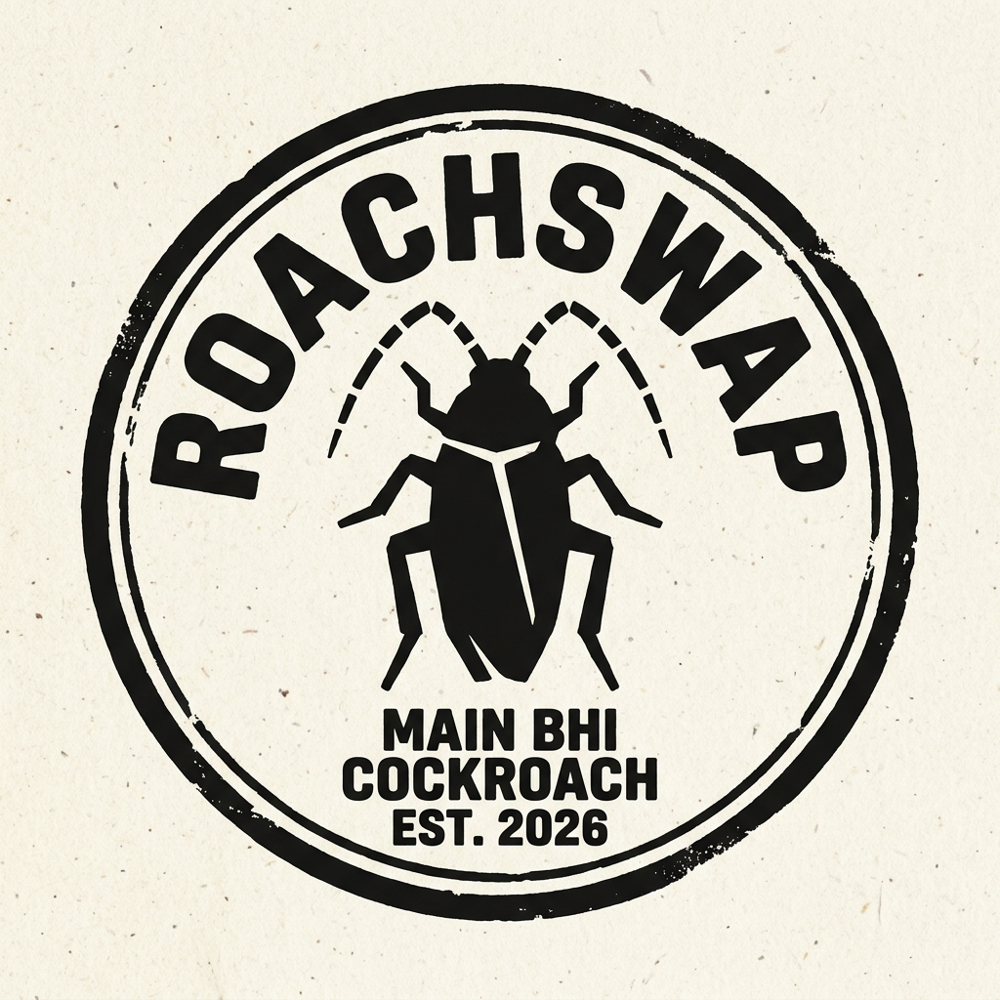

<div align="center">
  
  <h1>RoachSwap</h1>
  <p><strong>Voice of the Lazy & Unemployed.</strong></p>
  <p><em>They called us cockroaches. We decided to build.</em></p>
  
  [](https://github.com/Amrit-raj50/roachSwap/network/members)
  [](https://github.com/Amrit-raj50/roachSwap/stargazers)
  [](https://github.com/Amrit-raj50/roachSwap/issues)
  [](https://github.com/Amrit-raj50/roachSwap/pulls)
  [](https://github.com/Amrit-raj50/roachSwap/blob/main/LICENSE)
  [](https://discord.gg/BeFN78k5b)
</div>

---

## 🪳 What is RoachSwap?

RoachSwap is an open-source, satirical platform built for the frustrated, unemployed, and underemployed developer community. Inspired by the [Cockroach4India](https://www.cockroach4india.com/) movement, it’s a platform that ditches corporate gatekeeping in favor of raw survival instinct.

No sponsors. No 6-round technical interviews. Just spite, code, and community.

### Core Features:
- **The Anthill:** Find your swarm and build open-source projects driven by real grievances.
- **Moult Market:** A barter system for tech skills. Trade UI design for backend help. No currency allowed.
- **The Scrap Yard:** Dump your abandoned repositories for other scavengers to revive.
- **Wall of Rejections:** Upload your automated "unfortunately we went with other candidates" emails as a badge of honor.
- **ExoResume:** A transparent resume built entirely on what you've actually shipped in the colony.

---

## 🚀 Tech Stack

- **Frontend:** React (Vite), Tailwind CSS, React Router
- **Backend:** Node.js, Express
- **Database:** MongoDB
- **Authentication:** JWT (JSON Web Tokens)
- **Real-time:** Socket.io (for the HiveMind chat)

---

## 🛠️ Running Locally

Follow these steps to get your own colony running locally.

### 1. Clone the repository
```bash
git clone https://github.com/yourusername/RoachSwap.git
cd RoachSwap
```

### 2. Setup the Server
```bash
cd server
npm install
```
Create a `.env` file in the `server` directory (use `.env.example` as a template):
```env
PORT=5000
MONGO_URI=your_mongodb_connection_string
JWT_SECRET=your_jwt_secret
CLIENT_URL=http://localhost:5173
```
Start the backend:
```bash
npm run dev
```

### 3. Setup the Client
Open a new terminal window:
```bash
cd client
npm install
```
Create a `.env` file in the `client` directory:
```env
VITE_API_URL=http://localhost:5000/api
VITE_SOCKET_URL=http://localhost:5000
```
Start the frontend:
```bash
npm run dev
```

---

## 🤝 Contributing

We welcome all scavengers. Whether you want to fix a bug, add a new satirical feature, or improve the documentation, check out our [Contributing Guidelines](CONTRIBUTING.md) to get started.

## 🎖️ Contributors

This colony is built by survivors. Thank you to everyone who has contributed to RoachSwap!

<a href="https://github.com/Amrit-raj50/roachSwap/graphs/contributors">
  
</a>

---

## 📜 License

This project is licensed under the MIT License - see the [LICENSE](LICENSE) file for details.